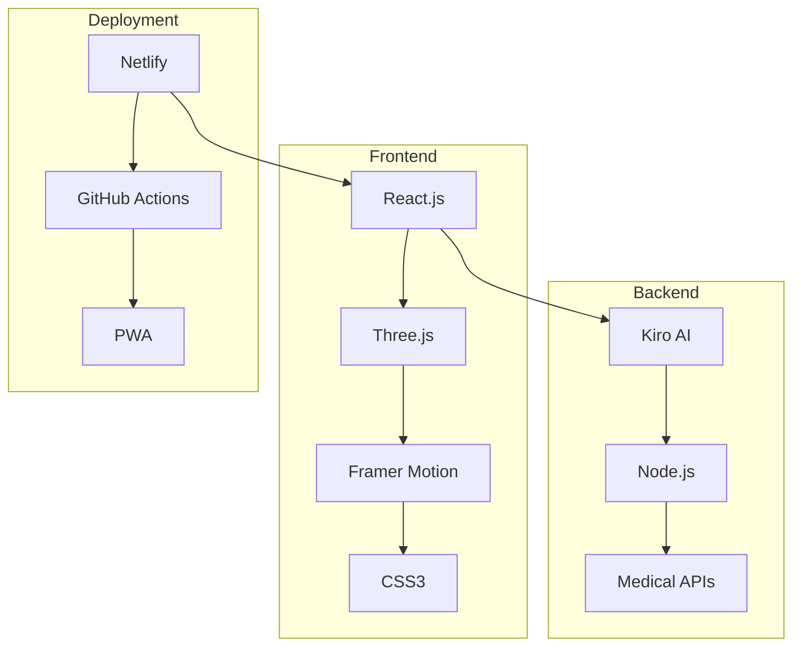
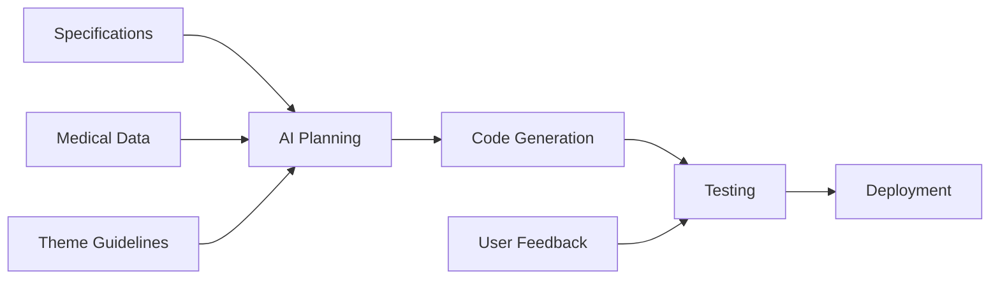

```markdown
---
title: "🏥💀 Cadaver's Crypt: The Resurrected Anatomy Lab"
description: "A haunted medical education platform where anatomy meets the afterlife"
badges:
  - https://img.shields.io/badge/Theme-Haunted%20Medical%20Lab-8b0000
  - https://img.shields.io/badge/Built%20with-Kiro_AI-2a9d8f
  - https://img.shields.io/badge/License-MIT-green
  - https://img.shields.io/badge/Deployed-Netlify-00C7B7
---

<div align="center">

# 🏥💀 Cadaver's Crypt: The Resurrected Anatomy Lab

### *A haunted medical education platform where anatomy meets the afterlife*

[](https://img.shields.io/badge/Theme-Haunted%20Medical%20Lab-8b0000)
[](https://img.shields.io/badge/Built%20with-Kiro_AI-2a9d8f)
[](https://img.shields.io/badge/License-MIT-green)
[](https://app.netlify.com/sites/cadaver-crypt/deploys)

</div>

## 👻 Welcome to the Haunted Anatomy Lab

Step into Dr. Cadaverson's abandoned anatomy laboratory, where medical education has been resurrected through AI and interactive technology. Learn anatomy by conversing with a ghostly professor and exploring spooky 3D models in this immersive educational experience.

<details>
<summary><strong>🎯 What is Cadaver's Crypt?</strong></summary>

Cadaver's Crypt transforms traditional anatomy education into an engaging Halloween-themed adventure. As a medical student trapped in a haunted laboratory, you must prove your anatomical knowledge to escape while learning from an AI-powered ghost professor.

```

```
╔═══════════════════════════════════════╗
║         CADAVER'S CRYPT LAB           ║
║                                       ║
║  🧪 🦴 💀 🧠 👁️ 🫀 🫁 ⚰️  🕯️       ║
║                                       ║
║  Student trapped in haunted lab       ║
║  must learn anatomy from ghost        ║
║  professor to escape the crypt!       ║
║                                       ║
╚═══════════════════════════════════════╝
```

```
</details>

## 🚀 Live Demo

- **🌐 Web Application**: [cadaver-crypt.netlify.app](https://cadaver-crypt.netlify.app)
- **🎥 Video Demo**: YouTube Demo
- **📱 PWA Ready**: Install as mobile app for offline learning

## ✨ Key Features

<details>
<summary><strong>👻 AI Ghost Professor</strong></summary>

- **Dr. Cadaverson**: Conversational AI tutor with spooky Victorian personality
- **Natural Language Processing**: Ask any anatomy question in plain English
- **Adaptive Learning**: Progressively challenges based on your knowledge level
- **Clinical Correlations**: Links anatomy to real medical cases and mysteries

```

```
Student ────[ Question ]───┐
                           │
                           ▼
┌─────────────────────────────────────┐
│        GHOST PROFESSOR AI           │
│                                     │
│  🧠 Knowledge Base    💬 NLP       │
│  🏥 Medical Data      🎯 Adaptive  │
│                                     │
└─────────────────────────────────────┘
                           │
                           ▼
                [ Personalized Answer + Quiz ]
```

```
</details>

<details>
<summary><strong>💀 Interactive 3D Anatomy</strong></summary>

- **Haunted Cadaver Models**: Layer-by-layer dissection with Halloween effects
- **Animated Specimens**: Twitching, floating anatomical structures
- **Medical Accuracy**: All models validated against anatomical standards
- **Interactive Exploration**: Click, rotate, and dissect in 3D space

```

```
┌─────────────────────────────────────┐
│         3D ANATOMY VIEWER           │
│                                     │
│        ┌─────────────────┐          │
│        │    🫀 HEART     │          │
│        │     Floating    │          │
│        │    +Twitching   │          │
│        └─────────────────┘          │
│                                     │
│  [Rotate] [Dissect] [Layer View]    │
└─────────────────────────────────────┘
```

```
</details>

<details>
<summary><strong>🧪 Spooky Assessment System</strong></summary>

- **Tombstone Trials**: Graded quizzes with ghostly consequences
- **Zombie Horde Mode**: Rapid-fire question survival challenges
- **Escape the Crypt**: Final exam narrative proving medical mastery
- **Ghostly Rewards**: Animated celebrations for correct answers

```

```
┌─────────────────────────────────────┐
│         ASSESSMENT SYSTEM           │
│                                     │
│  🪦 Tombstone Trials → Graded      │
│  🧟 Zombie Horde → Timed           │
│  🚪 Escape Crypt → Final Exam      │
│  👻 Rewards → Unlock Content       │
│                                     │
└─────────────────────────────────────┘
```

```
</details>

## 🛠️ Technology Stack



🏗️ Project Architecture

<details>
<summary><strong>System Architecture</strong></summary>```
    ╔═══════════════════════════════════════════════╗
    ║            CADAVER'S CRYPT ARCHITECTURE       ║
    ║                                               ║
    ║  ┌─────────────────────────────────────────┐  ║
    ║  │           NETLIFY DEPLOYMENT            │  ║
    ║  │                                         │  ║
    ║  │  ┌─────────────┐  ┌──────────────────┐  │  ║
    ║  │  │   React     │  │    Static        │  │  ║
    ║  │  │   App       │  │    Assets        │  │  ║
    ║  │  │             │  │   (3D Models,    │  │  ║
    ║  │  └─────────────┘  │    Sounds, etc.) │  │  ║
    ║  │                   └──────────────────┘  │  ║
    ║  └─────────────────────────────────────────┘  ║
    ║                       │                        ║
    ║  ┌─────────────────────────────────────────┐  ║
    ║  │            EXTERNAL SERVICES            │  ║
    ║  │                                         │  ║
    ║  │  ┌──────────┐  ┌──────────┐  ┌────────┐ │  ║
    ║  │  │  Kiro AI │  │ Medical  │  │ GitHub │ │  ║
    ║  │  │          │  │   APIs   │  │  Pages │ │  ║
    ║  │  └──────────┘  └──────────┘  └────────┘ │  ║
    ║  └─────────────────────────────────────────┘  ║
    ╚═══════════════════════════════════════════════╝
```

</details><details>
<summary><strong>Project Structure</strong></summary>```bash
cadaver-crypt/
├── public/
│   ├── 📁 3d-models/          # Anatomical models
│   ├── 📁 sounds/             # Haunted soundscape
│   ├── 📁 images/             # UI assets & icons
│   ├── manifest.json          # PWA manifest
│   └── sw.js                  # Service Worker
├── src/
│   ├── 📁 components/         # React components
│   │   ├── Lab/               # Laboratory scene
│   │   ├── AnatomyViewer/     # 3D model viewer
│   │   ├── Chat/              # AI conversation
│   │   └── Assessment/        # Quiz components
│   ├── 📁 hooks/              # Custom React hooks
│   ├── 📁 threejs/            # 3D graphics system
│   ├── 📁 ai/                 # Kiro integration
│   └── 📁 utils/              # Medical validation
├── netlify.toml               # Netlify configuration
├── package.json
└── README.md
```

</details>🚀 Quick Start

<details>
<summary><strong>Local Development</strong></summary>Prerequisites

· Node.js 16+
· Modern web browser with WebGL support

Installation

```bash
# Clone the repository
git clone https://github.com/senushidinara/cadaver-crypt.git

# Navigate to project directory
cd cadaver-crypt

# Install dependencies
npm install

# Start development server
npm start
```

Build for Production

```bash
# Create production build
npm run build

# The build folder is ready for Netlify deployment
```

</details><details>
<summary><strong>Netlify Deployment</strong></summary>Automatic Deployment

1. Connect GitHub repo to Netlify
2. Configure build settings:
   · Build Command: npm run build
   · Publish Directory: build
3. Deploy automatically on git push

Manual Deployment

```bash
# Build the project
npm run build

# Deploy to Netlify
npx netlify-cli deploy --prod --dir=build
```

Environment Variables

```env
REACT_APP_KIRO_API_KEY=your_kiro_api_key
REACT_APP_MEDICAL_API_URL=your_medical_api_url
```

</details>🎮 How to Use

<details>
<summary><strong>User Journey</strong></summary>```
    ┌─────────────────────────────────────────────────┐
    │               USER JOURNEY FLOW                 │
    ├─────────────────────────────────────────────────┤
    │                                                 │
    │  1. 🚪 Enter Laboratory                        │
    │     - Load haunted lab environment             │
    │     - Atmospheric soundscape                   │
    │                                                 │
    │  2. 👻 Meet Dr. Cadaverson                     │
    │     - AI-powered conversation                  │
    │     - Initial assessment                       │
    │                                                 │
    │  3. 🦴 Learn Anatomy                           │
    │     - Interactive 3D models                    │
    │     - Layer-by-layer dissection                │
    │                                                 │
    │  4. 🧪 Take Assessments                        │
    │     - Tombstone Trials (quizzes)               │
    │     - Zombie Horde (timed challenges)          │
    │                                                 │
    │  5. 🎓 Progress & Unlock                       │
    │     - Earn ghostly rewards                     │
    │     - Unlock special modes                     │
    │                                                 │
    │  6. 🏆 Escape the Crypt                        │
    │     - Final comprehensive exam                 │
    │     - Certificate of completion                │
    │                                                 │
    └─────────────────────────────────────────────────┘
```

</details>🏥 Medical Accuracy

All educational content maintains 100% anatomical accuracy:

· ✅ Verified against Terminologia Anatomica standards
· ✅ Peer-reviewed clinical correlations
· ✅ Evidence-based medical information
· ✅ Progressive complexity aligned with medical curricula

🤖 Kiro AI Integration

<details>
<summary><strong>AI Development Process</strong></summary>This project was built entirely using Kiro's AI development platform:

Development Workflow



Key AI Features

· Conversational Interface: Natural dialogue with Dr. Cadaverson
· Medical Validation: Real-time anatomical accuracy checking
· Adaptive Learning: Personalized difficulty progression
· Content Generation: Dynamic quiz and case study creation

</details>📱 Platform Support

· Desktop: Full 3D experience with keyboard/mouse controls
· Tablet: Touch-optimized interface with gesture support
· Mobile: Responsive design with mobile-friendly interactions
· Offline: Progressive Web App functionality for uninterrupted learning

🤝 Contributing

<details>
<summary><strong>Contribution Guidelines</strong></summary>We welcome contributions from developers, medical professionals, and educators:

Development Process

1. Fork the repository
2. Create a feature branch: git checkout -b feature/amazing-feature
3. Commit changes: git commit -m 'Add amazing feature'
4. Push to branch: git push origin feature/amazing-feature
5. Open a Pull Request

Areas for Contribution

· Additional anatomical models
· New quiz questions and clinical cases
· UI/UX improvements
· Performance optimizations
· Translation and localization

</details>📄 License

This project is licensed under the MIT License - see the LICENSE file for details.

👨‍⚕️ About the Creator

Senushi Dinara - Medical Student & AI Developer

· 🎓 Medical education enthusiast
· 🤖 AI and neuroscience researcher
· 🏆 Hackathon competitor and innovator
· 🌟 Passionate about educational technology

🔗 Links

· 📚 Documentation: Project Wiki
· 🐛 Issue Tracker: GitHub Issues
· 💬 Discussion: GitHub Discussions

🙏 Acknowledgments

· Kiro AI for transformative development capabilities
· Medical professionals who verified anatomical accuracy
· Open source community for amazing tools and libraries
· Netlify for seamless deployment platform
· Test users who provided valuable feedback during development

---

<div align="center">Built with ❤️ and 👻 for the future of medical education

"The only thing we have to fear is forgetting our anatomy" - Dr. Cadaverson

Live Demo: cadaver-crypt.netlify.app

</div>
```
